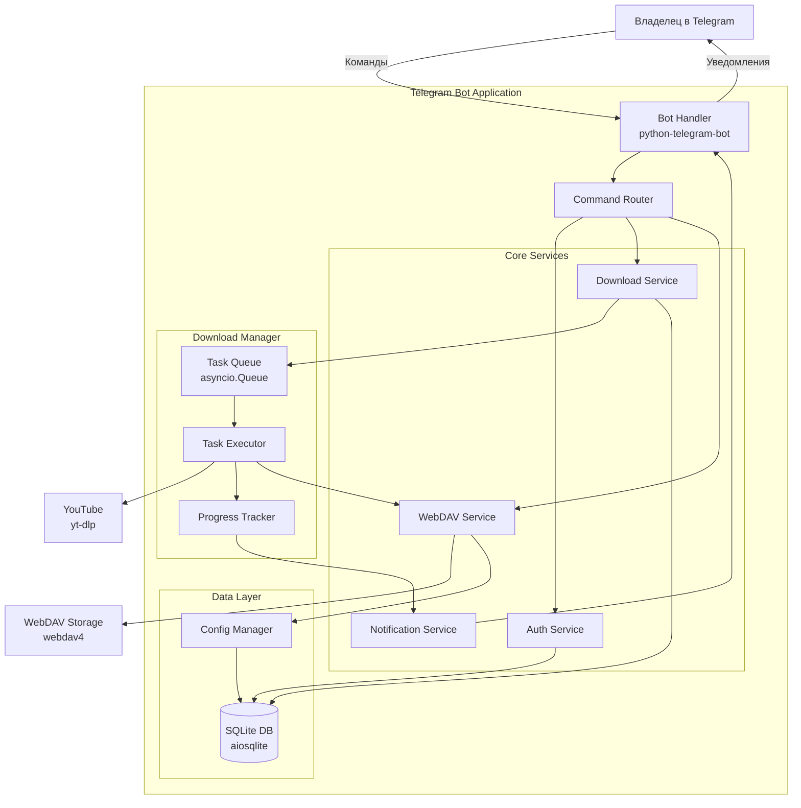
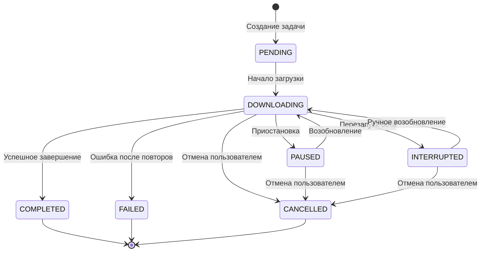
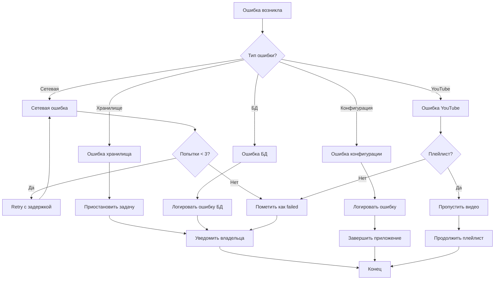

# Документ проектирования: Telegram-бот для скачивания YouTube видео на WebDAV

## Обзор

Система представляет собой асинхронный Telegram-бот на Python, который загружает видео с YouTube и сохраняет их на внешнее WebDAV хранилище. Архитектура построена на событийно-ориентированной модели с использованием asyncio для эффективного управления ресурсами на VPS с ограниченными характеристиками (2GB RAM, 2 CPU cores).

Основные принципы проектирования:
- Асинхронная обработка всех I/O операций
- Минимальное использование памяти через потоковую загрузку
- Модульная архитектура с четким разделением ответственности
- Персистентное хранение состояния для восстановления после сбоев

## Архитектура

### Технологический стек

**Язык программирования:** Python 3.11+

**Основные библиотеки:**
- `python-telegram-bot` (v21+) - асинхронная библиотека для Telegram Bot API
- `yt-dlp` - загрузка видео с YouTube с поддержкой множества форматов
- `webdav4` - современный WebDAV клиент с поддержкой fsspec
- `aiosqlite` - асинхронный драйвер для SQLite
- `asyncio` - встроенная библиотека для асинхронного программирования

**База данных:** SQLite 3 (через aiosqlite)

**Развертывание:**
- Systemd service для автозапуска
- Python virtual environment для изоляции зависимостей
- Логирование через стандартный модуль logging

### Архитектурная диаграмма



### Компоненты высокого уровня

1. **Bot Handler** - точка входа, обработка Telegram событий
2. **Command Router** - маршрутизация команд к соответствующим сервисам
3. **Auth Service** - проверка прав доступа владельца
4. **Download Service** - управление жизненным циклом загрузок
5. **WebDAV Service** - взаимодействие с хранилищем
6. **Notification Service** - отправка уведомлений владельцу
7. **Task Queue** - очередь задач загрузки
8. **Task Executor** - выполнение загрузок
9. **Progress Tracker** - отслеживание прогресса
10. **Database** - персистентное хранилище
11. **Config Manager** - управление конфигурацией

## Компоненты и интерфейсы

### 1. Bot Handler

**Ответственность:** Обработка входящих сообщений и команд от Telegram

**Интерфейс:**
```python
class BotHandler:
    async def start(self) -> None:
        """Запуск бота"""
        
    async def stop(self) -> None:
        """Остановка бота"""
        
    async def handle_command(self, update: Update, context: ContextTypes.DEFAULT_TYPE) -> None:
        """Обработка команды"""
        
    async def handle_message(self, update: Update, context: ContextTypes.DEFAULT_TYPE) -> None:
        """Обработка текстового сообщения (URL)"""
```

**Зависимости:**
- CommandRouter
- AuthService

### 2. Command Router

**Ответственность:** Маршрутизация команд к соответствующим обработчикам

**Интерфейс:**
```python
class CommandRouter:
    async def route_command(self, command: str, args: list[str], user_id: int) -> str:
        """Маршрутизация команды к обработчику"""
        
    async def handle_start(self, user_id: int) -> str:
        """Обработка /start"""
        
    async def handle_help(self, user_id: int) -> str:
        """Обработка /help"""
        
    async def handle_status(self, user_id: int) -> str:
        """Обработка /status"""
        
    async def handle_history(self, user_id: int, status_filter: str | None) -> str:
        """Обработка /history"""
        
    async def handle_cancel(self, user_id: int, task_id: str) -> str:
        """Обработка /cancel"""
        
    async def handle_pause(self, user_id: int, task_id: str) -> str:
        """Обработка /pause"""
        
    async def handle_resume(self, user_id: int, task_id: str) -> str:
        """Обработка /resume"""
        
    async def handle_connect(self, user_id: int, url: str, username: str, password: str) -> str:
        """Обработка /connect"""
```

**Зависимости:**
- DownloadService
- WebDAVService
- NotificationService

### 3. Auth Service

**Ответственность:** Проверка прав доступа

**Интерфейс:**
```python
class AuthService:
    def __init__(self, owner_id: int):
        """Инициализация с ID владельца"""
        
    def is_owner(self, user_id: int) -> bool:
        """Проверка, является ли пользователь владельцем"""
```

### 4. Download Service

**Ответственность:** Управление загрузками видео

**Интерфейс:**
```python
@dataclass
class VideoMetadata:
    video_id: str
    title: str
    duration: int  # секунды
    available_qualities: list[str]
    estimated_sizes: dict[str, int]  # качество -> размер в байтах

@dataclass
class DownloadTask:
    task_id: str
    url: str
    video_metadata: VideoMetadata
    quality: str
    notification_settings: NotificationSettings
    status: TaskStatus  # pending, downloading, paused, completed, failed, cancelled
    progress: float  # 0.0 - 1.0
    error_message: str | None
    created_at: datetime
    updated_at: datetime

class DownloadService:
    async def get_video_metadata(self, url: str) -> VideoMetadata:
        """Извлечение метаданных видео"""
        
    async def get_playlist_metadata(self, url: str) -> list[VideoMetadata]:
        """Извлечение метаданных плейлиста"""
        
    async def create_download_task(
        self, 
        url: str, 
        quality: str,
        notification_settings: NotificationSettings
    ) -> DownloadTask:
        """Создание задачи загрузки"""
        
    async def get_active_tasks(self) -> list[DownloadTask]:
        """Получение активных задач"""
        
    async def get_task_by_id(self, task_id: str) -> DownloadTask | None:
        """Получение задачи по ID"""
        
    async def cancel_task(self, task_id: str) -> bool:
        """Отмена задачи"""
        
    async def pause_task(self, task_id: str) -> bool:
        """Приостановка задачи"""
        
    async def resume_task(self, task_id: str) -> bool:
        """Возобновление задачи"""
        
    async def get_history(self, status_filter: str | None = None) -> list[DownloadTask]:
        """Получение истории загрузок"""
```

**Зависимости:**
- TaskQueue
- Database

### 5. WebDAV Service

**Ответственность:** Взаимодействие с WebDAV хранилищем

**Интерфейс:**
```python
@dataclass
class WebDAVConfig:
    url: str
    username: str
    password: str
    
@dataclass
class StorageInfo:
    total_space: int  # байты
    used_space: int
    free_space: int
    is_connected: bool

class WebDAVService:
    async def connect(self, config: WebDAVConfig) -> bool:
        """Подключение к WebDAV хранилищу"""
        
    async def disconnect(self) -> None:
        """Отключение от хранилища"""
        
    async def test_connection(self) -> bool:
        """Проверка соединения"""
        
    async def get_storage_info(self) -> StorageInfo:
        """Получение информации о хранилище"""
        
    async def upload_file(
        self, 
        local_path: str, 
        remote_path: str,
        progress_callback: Callable[[int, int], None] | None = None
    ) -> bool:
        """Загрузка файла на хранилище"""
        
    async def create_directory(self, path: str) -> bool:
        """Создание директории"""
        
    async def file_exists(self, path: str) -> bool:
        """Проверка существования файла"""
        
    def sanitize_filename(self, filename: str) -> str:
        """Очистка имени файла от недопустимых символов"""
```

**Зависимости:**
- ConfigManager

### 6. Notification Service

**Ответственность:** Отправка уведомлений владельцу

**Интерфейс:**
```python
@dataclass
class NotificationSettings:
    notify_start: bool
    notify_progress: bool
    notify_completion: bool
    notify_errors: bool
    
    @classmethod
    def all_notifications(cls) -> 'NotificationSettings':
        """Пресет: все уведомления"""
        
    @classmethod
    def important_only(cls) -> 'NotificationSettings':
        """Пресет: только важные (старт и завершение)"""
        
    @classmethod
    def errors_only(cls) -> 'NotificationSettings':
        """Пресет: только ошибки"""
        
    @classmethod
    def no_notifications(cls) -> 'NotificationSettings':
        """Пресет: без уведомлений"""

class NotificationService:
    async def notify_download_start(self, task: DownloadTask) -> None:
        """Уведомление о начале загрузки"""
        
    async def notify_download_progress(self, task: DownloadTask, progress: float) -> None:
        """Уведомление о прогрессе загрузки"""
        
    async def notify_download_complete(self, task: DownloadTask, remote_path: str) -> None:
        """Уведомление о завершении загрузки"""
        
    async def notify_download_error(self, task: DownloadTask, error: str) -> None:
        """Уведомление об ошибке"""
        
    async def notify_storage_disconnected(self) -> None:
        """Уведомление об отключении хранилища"""
        
    async def notify_storage_full(self, task: DownloadTask) -> None:
        """Уведомление о нехватке места"""
```

**Зависимости:**
- BotHandler

### 7. Task Queue & Task Executor

**Ответственность:** Управление очередью и выполнение задач загрузки

**Интерфейс:**
```python
class TaskQueue:
    def __init__(self, max_concurrent: int = 2):
        """Инициализация очереди с ограничением параллельных задач"""
        
    async def enqueue(self, task: DownloadTask) -> None:
        """Добавление задачи в очередь"""
        
    async def start_processing(self) -> None:
        """Запуск обработки очереди"""
        
    async def stop_processing(self) -> None:
        """Остановка обработки очереди"""

class TaskExecutor:
    async def execute_download(self, task: DownloadTask) -> None:
        """Выполнение загрузки видео"""
        
    async def download_video(
        self, 
        url: str, 
        quality: str,
        output_path: str,
        progress_callback: Callable[[float], None]
    ) -> str:
        """Загрузка видео через yt-dlp"""
        
    async def cleanup_temp_files(self, task_id: str) -> None:
        """Очистка временных файлов"""
```

**Зависимости:**
- DownloadService
- WebDAVService
- ProgressTracker
- NotificationService

### 8. Progress Tracker

**Ответственность:** Отслеживание прогресса загрузок

**Интерфейс:**
```python
class ProgressTracker:
    async def update_progress(self, task_id: str, progress: float) -> None:
        """Обновление прогресса задачи"""
        
    async def should_notify(self, task_id: str, current_progress: float) -> bool:
        """Проверка, нужно ли отправить уведомление (каждые 10%)"""
        
    def get_progress(self, task_id: str) -> float:
        """Получение текущего прогресса"""
```

### 9. Database

**Ответственность:** Персистентное хранение данных

**Схема базы данных:**

```sql
-- Таблица задач загрузки
CREATE TABLE download_tasks (
    task_id TEXT PRIMARY KEY,
    url TEXT NOT NULL,
    video_id TEXT NOT NULL,
    title TEXT NOT NULL,
    quality TEXT NOT NULL,
    status TEXT NOT NULL,
    progress REAL DEFAULT 0.0,
    file_size INTEGER,
    remote_path TEXT,
    error_message TEXT,
    notify_start INTEGER DEFAULT 1,
    notify_progress INTEGER DEFAULT 1,
    notify_completion INTEGER DEFAULT 1,
    notify_errors INTEGER DEFAULT 1,
    created_at TEXT NOT NULL,
    updated_at TEXT NOT NULL
);

-- Таблица конфигурации WebDAV
CREATE TABLE webdav_config (
    id INTEGER PRIMARY KEY CHECK (id = 1),
    url TEXT NOT NULL,
    username TEXT NOT NULL,
    password_encrypted TEXT NOT NULL,
    created_at TEXT NOT NULL,
    updated_at TEXT NOT NULL
);

-- Индексы
CREATE INDEX idx_tasks_status ON download_tasks(status);
CREATE INDEX idx_tasks_created_at ON download_tasks(created_at DESC);
```

**Интерфейс:**
```python
class Database:
    async def initialize(self) -> None:
        """Инициализация базы данных"""
        
    async def save_task(self, task: DownloadTask) -> None:
        """Сохранение задачи"""
        
    async def update_task(self, task: DownloadTask) -> None:
        """Обновление задачи"""
        
    async def get_task(self, task_id: str) -> DownloadTask | None:
        """Получение задачи по ID"""
        
    async def get_tasks_by_status(self, status: str) -> list[DownloadTask]:
        """Получение задач по статусу"""
        
    async def get_all_tasks(self) -> list[DownloadTask]:
        """Получение всех задач"""
        
    async def save_webdav_config(self, config: WebDAVConfig) -> None:
        """Сохранение конфигурации WebDAV"""
        
    async def get_webdav_config(self) -> WebDAVConfig | None:
        """Получение конфигурации WebDAV"""
```

### 10. Config Manager

**Ответственность:** Управление конфигурацией приложения

**Интерфейс:**
```python
@dataclass
class AppConfig:
    telegram_token: str
    owner_id: int
    database_path: str
    temp_download_path: str
    log_level: str
    max_concurrent_downloads: int

class ConfigManager:
    @staticmethod
    def load_from_env() -> AppConfig:
        """Загрузка конфигурации из переменных окружения"""
        
    @staticmethod
    def validate_config(config: AppConfig) -> list[str]:
        """Валидация конфигурации, возвращает список ошибок"""
```

## Модели данных

### TaskStatus (Enum)

```python
class TaskStatus(str, Enum):
    PENDING = "pending"
    DOWNLOADING = "downloading"
    PAUSED = "paused"
    COMPLETED = "completed"
    FAILED = "failed"
    CANCELLED = "cancelled"
    INTERRUPTED = "interrupted"
```

### Диаграмма состояний задачи



## Свойства корректности

*Свойство - это характеристика или поведение, которое должно выполняться во всех допустимых выполнениях системы - по сути, формальное утверждение о том, что система должна делать. Свойства служат мостом между человекочитаемыми спецификациями и машинно-проверяемыми гарантиями корректности.*


### Property Reflection

После анализа всех acceptance criteria, я выявил следующие группы свойств, которые можно объединить для устранения избыточности:

**Группа 1: Обновление статусов в БД**
- 3.6, 7.4, 7.7 - все проверяют, что статус корректно обновляется в БД при различных событиях
- Можно объединить в одно свойство: "Для любого изменения статуса задачи, БД должна отражать новый статус"

**Группа 2: Уведомления владельца**
- 2.7, 10.2, 10.3, 10.6 - все проверяют отправку уведомлений при различных событиях
- Эти свойства различаются по типу события, поэтому оставляем отдельно

**Группа 3: Персистентность данных**
- 2.4, 6.7, 8.4 - все проверяют сохранение данных в БД
- Можно объединить в одно свойство round-trip: "Для любых данных, сохранение и загрузка должны возвращать эквивалентные данные"

**Группа 4: Логирование событий**
- 13.1, 13.2, 13.3, 13.4 - все проверяют логирование различных событий
- Можно объединить в одно свойство: "Для любого критического события, должна существовать запись в логе"

**Группа 5: Управление задачами**
- 7.2, 7.5 - отмена и приостановка задач
- Эти операции различны, оставляем отдельно

После reflection, я выделил 35 уникальных свойств для тестирования.

### Свойства корректности

#### Свойство 1: Отклонение неавторизованных пользователей
*Для любого* пользователя с Telegram ID, отличным от ID владельца, все команды должны быть отклонены с сообщением "Доступ запрещен"

**Validates: Requirements 1.2**

#### Свойство 2: Подключение к WebDAV с валидными учетными данными
*Для любых* валидных учетных данных WebDAV (URL, логин, пароль), клиент должен успешно установить соединение и проверить доступность хранилища

**Validates: Requirements 2.1**

#### Свойство 3: Использование Basic Auth для WebDAV
*Для любого* запроса к WebDAV хранилищу, заголовки HTTP должны содержать корректную Basic Authentication с предоставленными учетными данными

**Validates: Requirements 2.2**

#### Свойство 4: Описательные сообщения об ошибках подключения
*Для любой* ошибки подключения к WebDAV хранилищу, система должна вернуть сообщение, содержащее описание причины ошибки

**Validates: Requirements 2.3**

#### Свойство 5: Round-trip персистентности данных
*Для любых* данных (конфигурация WebDAV, настройки уведомлений, задачи загрузки), сохранение в БД и последующая загрузка должны возвращать эквивалентные данные

**Validates: Requirements 2.4, 6.7, 8.4**

#### Свойство 6: Единственное активное подключение к хранилищу
*В любой* момент времени, система должна поддерживать подключение только к одному WebDAV хранилищу

**Validates: Requirements 2.5**

#### Свойство 7: Переподключение к новому хранилищу
*Для любого* запроса переподключения к новому хранилищу, система должна отключиться от текущего хранилища перед установкой нового соединения

**Validates: Requirements 2.6**

#### Свойство 8: Приостановка задач при потере соединения с хранилищем
*Для любых* активных задач загрузки, если хранилище становится недоступным, все задачи должны быть приостановлены

**Validates: Requirements 2.7, 10.3**

#### Свойство 9: Извлечение метаданных видео
*Для любого* валидного URL видео YouTube, система должна извлечь метаданные, включающие название, длительность, доступные качества и размеры

**Validates: Requirements 3.1**

#### Свойство 10: Отображение метаданных с размерами
*Для любых* извлеченных метаданных видео, отображаемая информация должна содержать список качеств и примерный размер файла для каждого качества

**Validates: Requirements 3.2**

#### Свойство 11: Создание задачи с выбранным качеством
*Для любого* выбора качества видео, созданная задача загрузки должна содержать именно выбранное качество

**Validates: Requirements 3.3**

#### Свойство 12: Сохранение видео в формате MP4
*Для любого* успешно загруженного видео, файл в хранилище должен иметь формат MP4

**Validates: Requirements 3.5**

#### Свойство 13: Обновление статуса задачи в БД
*Для любого* изменения статуса задачи (завершено, отменено, приостановлено, ошибка), БД должна немедленно отражать новый статус

**Validates: Requirements 3.6, 7.4, 7.7**

#### Свойство 14: Обработка невалидных URL
*Для любого* невалидного URL или недоступного видео, система должна отправить сообщение об ошибке с описанием проблемы

**Validates: Requirements 3.7**

#### Свойство 15: Извлечение метаданных плейлиста
*Для любого* валидного URL плейлиста YouTube, система должна извлечь список всех видео с их метаданными

**Validates: Requirements 4.1**

#### Свойство 16: Отображение суммарной информации о плейлисте
*Для любого* обрабатываемого плейлиста, отображаемая информация должна содержать общее количество видео и суммарный примерный размер

**Validates: Requirements 4.2**

#### Свойство 17: Создание задач для всех видео плейлиста
*Для любого* плейлиста с N видео, система должна создать ровно N задач загрузки с выбранным качеством

**Validates: Requirements 4.3**

#### Свойство 18: Последовательная загрузка видео плейлиста
*Для любого* плейлиста, видео должны загружаться последовательно, а не параллельно

**Validates: Requirements 4.4, 4.5**

#### Свойство 19: Пропуск недоступных видео в плейлисте
*Для любого* плейлиста с недоступными видео, система должна пропустить недоступные и продолжить загрузку остальных

**Validates: Requirements 4.6**

#### Свойство 20: Итоговый отчет по плейлисту
*Для любого* завершенного плейлиста, отчет должен содержать количество успешных и неудачных загрузок

**Validates: Requirements 4.7**

#### Свойство 21: Неблокирующая работа бота
*Для любой* выполняющейся загрузки, бот должен оставаться доступным для обработки других команд

**Validates: Requirements 5.2**

#### Свойство 22: Параллельное выполнение задач
*Для любых* нескольких задач загрузки, система должна поддерживать их одновременное выполнение (до лимита)

**Validates: Requirements 5.3**

#### Свойство 23: Отправка только выбранных уведомлений
*Для любой* задачи загрузки с настройками уведомлений, система должна отправлять только те типы уведомлений, которые выбраны в настройках

**Validates: Requirements 6.3**

#### Свойство 24: Уведомления прогресса каждые 10%
*Для любой* задачи с включенными уведомлениями прогресса, система должна отправлять уведомление при каждом достижении кратного 10% прогресса

**Validates: Requirements 6.6**

#### Свойство 25: Фильтрация активных задач
*Для любого* запроса списка активных загрузок, результат должен содержать только задачи со статусом "в процессе" или "приостановлено"

**Validates: Requirements 7.1**

#### Свойство 26: Отмена задачи и очистка временных файлов
*Для любой* отмененной задачи, частично загруженный файл должен быть удален из временного хранилища

**Validates: Requirements 7.2, 7.3**

#### Свойство 27: Возобновление задачи с сохраненного прогресса
*Для любой* приостановленной задачи, возобновление должно продолжить загрузку с того же прогресса, на котором она была приостановлена

**Validates: Requirements 7.5, 7.6, 7.9**

#### Свойство 28: Отмена плейлиста останавливает оставшиеся видео
*Для любой* задачи плейлиста, отмена должна остановить текущее видео и предотвратить загрузку оставшихся видео

**Validates: Requirements 7.8**

#### Свойство 29: Отображение полной информации в истории
*Для любой* записи в истории загрузок, отображаемая информация должна содержать название, дату, статус, размер и качество

**Validates: Requirements 8.2**

#### Свойство 30: Фильтрация истории по статусу
*Для любого* запроса истории с фильтром по статусу, результат должен содержать только задачи с указанным статусом

**Validates: Requirements 8.3**

#### Свойство 31: Детальная информация о задаче
*Для любой* задачи, детальная информация должна включать URL источника, путь в хранилище, настройки уведомлений и сообщения об ошибках

**Validates: Requirements 8.5**

#### Свойство 32: Предупреждение о нехватке места
*Для любого* видео, размер которого превышает доступное пространство в хранилище, система должна предупредить владельца перед началом загрузки

**Validates: Requirements 9.3**

#### Свойство 33: Приостановка при заполнении хранилища
*Для любой* загрузки, если хранилище заполняется во время выполнения, задача должна быть приостановлена с уведомлением

**Validates: Requirements 9.5**

#### Свойство 34: Retry логика с экспоненциальной задержкой
*Для любой* сетевой ошибки во время загрузки, система должна повторить попытку до 3 раз с экспоненциально увеличивающейся задержкой

**Validates: Requirements 10.1**

#### Свойство 35: Финальный статус после исчерпания попыток
*Для любой* задачи, после исчерпания всех попыток повтора, статус должен быть установлен в "ошибка" с уведомлением владельца

**Validates: Requirements 10.2**

#### Свойство 36: Восстановление состояния после перезапуска
*Для любых* незавершенных задач в БД, после перезапуска бота система должна восстановить информацию о них

**Validates: Requirements 10.5**

#### Свойство 37: Маркировка прерванных задач
*Для любой* незавершенной задачи после перезапуска, статус должен быть обновлен на "прервано"

**Validates: Requirements 10.6**

#### Свойство 38: Организация файлов плейлиста в папки
*Для любого* видео из плейлиста, файл должен быть сохранен в папке с названием плейлиста

**Validates: Requirements 11.1**

#### Свойство 39: Санитизация имен файлов
*Для любого* имени файла, все недопустимые символы должны быть заменены на подчеркивания

**Validates: Requirements 11.3**

#### Свойство 40: Разрешение конфликтов имен файлов
*Для любого* файла, если файл с таким именем уже существует, к имени должен быть добавлен числовой суффикс

**Validates: Requirements 11.4**

#### Свойство 41: Формат имени файла с идентификатором
*Для любого* сохраненного видео, имя файла должно содержать оригинальное название и идентификатор YouTube

**Validates: Requirements 11.5**

#### Свойство 42: Обработка неизвестных команд
*Для любой* неизвестной команды, бот должен отправить сообщение с предложением использовать /help

**Validates: Requirements 12.9**

#### Свойство 43: Логирование критических событий
*Для любого* критического события (ошибка, начало/завершение задачи, попытка доступа), должна существовать запись в лог-файле с временной меткой

**Validates: Requirements 13.1, 13.2, 13.3, 13.4**

#### Свойство 44: Ротация лог-файлов
*Для любого* лог-файла, при достижении размера 10MB должна произойти ротация

**Validates: Requirements 13.5**

#### Свойство 45: Retention лог-файлов
*Для любых* лог-файлов старше 30 дней, они должны быть удалены

**Validates: Requirements 13.6**

#### Свойство 46: Валидация обязательных параметров конфигурации
*Для любого* обязательного параметра конфигурации (токен бота, путь к БД), если он отсутствует, бот должен вывести описательное сообщение об ошибке и завершить работу

**Validates: Requirements 14.2, 14.3**

#### Свойство 47: Ограничение параллельных загрузок
*Для любого* момента времени, количество одновременно выполняющихся задач не должно превышать установленный лимит (по умолчанию 2)

**Validates: Requirements 15.4**

#### Свойство 48: Throttling при высоком использовании памяти
*Для любого* момента, когда использование памяти превышает 80%, новые задачи не должны запускаться до освобождения ресурсов

**Validates: Requirements 15.5**

## Обработка ошибок

### Категории ошибок

1. **Сетевые ошибки**
   - Timeout при подключении к YouTube
   - Timeout при подключении к WebDAV
   - Потеря соединения во время загрузки
   - Стратегия: Retry с экспоненциальной задержкой (до 3 попыток)

2. **Ошибки хранилища**
   - Недостаточно места
   - Потеря доступа к WebDAV
   - Ошибки записи файлов
   - Стратегия: Приостановка задачи, уведомление владельца

3. **Ошибки YouTube**
   - Видео недоступно
   - Видео удалено
   - Ограничения доступа
   - Стратегия: Пропуск видео (для плейлистов), уведомление об ошибке

4. **Ошибки конфигурации**
   - Отсутствующие обязательные параметры
   - Невалидные учетные данные
   - Стратегия: Fail-fast при запуске, описательные сообщения

5. **Ошибки базы данных**
   - Ошибки чтения/записи
   - Corruption БД
   - Стратегия: Логирование, попытка восстановления, уведомление

### Диаграмма обработки ошибок



## Стратегия тестирования

### Подход к тестированию

Система будет тестироваться с использованием двух дополняющих подходов:

1. **Unit тесты** - для конкретных примеров, edge cases и интеграционных точек
2. **Property-based тесты** - для проверки универсальных свойств на множестве входных данных

### Property-Based Testing

**Библиотека:** `hypothesis` для Python

**Конфигурация:**
- Минимум 100 итераций на каждый property тест
- Каждый тест должен быть помечен комментарием с ссылкой на свойство из design.md
- Формат тега: `# Feature: youtube-webdav-bot, Property N: <текст свойства>`

**Пример property теста:**

```python
from hypothesis import given, strategies as st
import pytest

# Feature: youtube-webdav-bot, Property 2: Подключение к WebDAV с валидными учетными данными
@given(
    url=st.text(min_size=10, max_size=100),
    username=st.text(min_size=3, max_size=50),
    password=st.text(min_size=8, max_size=100)
)
@pytest.mark.asyncio
async def test_webdav_connection_with_valid_credentials(url, username, password):
    """
    Для любых валидных учетных данных WebDAV,
    клиент должен успешно установить соединение
    """
    config = WebDAVConfig(url=url, username=username, password=password)
    service = WebDAVService()
    
    # Mock WebDAV server response
    with mock_webdav_server(config):
        result = await service.connect(config)
        assert result is True
        assert await service.test_connection() is True
```

### Unit Testing

**Фреймворк:** `pytest` с `pytest-asyncio`

**Фокус unit тестов:**
- Конкретные примеры команд бота (/start, /help, /status и т.д.)
- Edge cases (пустые плейлисты, очень большие файлы, специальные символы в именах)
- Интеграционные точки между компонентами
- Ошибочные сценарии (невалидные URL, недоступные видео)

**Пример unit теста:**

```python
@pytest.mark.asyncio
async def test_start_command_shows_welcome_message():
    """
    Команда /start должна отображать приветственное сообщение
    и список доступных команд
    """
    bot_handler = BotHandler(owner_id=12345)
    update = create_mock_update(user_id=12345, text="/start")
    
    response = await bot_handler.handle_command(update, context)
    
    assert "Добро пожаловать" in response
    assert "/help" in response
    assert "/status" in response
```

### Тестовое покрытие

**Цели покрытия:**
- Общее покрытие кода: минимум 80%
- Критические компоненты (DownloadService, WebDAVService): минимум 90%
- Property тесты: все 48 свойств корректности
- Unit тесты: все команды бота, основные edge cases

### Интеграционное тестирование

**Подход:**
- Использование Docker контейнеров для WebDAV сервера (например, `bytemark/webdav`)
- Mock YouTube API через `yt-dlp` fixtures
- Тестовая SQLite БД в памяти

**Сценарии интеграционных тестов:**
1. Полный цикл загрузки одного видео
2. Загрузка плейлиста с пропуском недоступного видео
3. Приостановка и возобновление загрузки
4. Восстановление после перезапуска бота
5. Обработка потери соединения с WebDAV

### Continuous Integration

**CI Pipeline:**
1. Lint (flake8, mypy для type checking)
2. Unit тесты
3. Property-based тесты
4. Интеграционные тесты
5. Проверка покрытия кода

## Deployment

### Системные требования

- Ubuntu 22.04 или 24.04 LTS
- Python 3.11 или выше
- 2GB RAM минимум
- 2 CPU cores минимум
- 10GB свободного места для временных файлов

### Установка

**Автоматическая установка через скрипт:**

```bash
curl -sSL https://raw.githubusercontent.com/user/youtube-webdav-bot/main/install.sh | bash
```

**Ручная установка:**

```bash
# 1. Клонирование репозитория
git clone https://github.com/user/youtube-webdav-bot.git
cd youtube-webdav-bot

# 2. Создание virtual environment
python3.11 -m venv venv
source venv/bin/activate

# 3. Установка зависимостей
pip install -r requirements.txt

# 4. Создание конфигурации
cp .env.example .env
nano .env  # Редактирование конфигурации

# 5. Инициализация базы данных
python -m bot.database init

# 6. Установка systemd service
sudo cp systemd/youtube-webdav-bot.service /etc/systemd/system/
sudo systemctl daemon-reload
sudo systemctl enable youtube-webdav-bot
sudo systemctl start youtube-webdav-bot
```

### Конфигурация (.env файл)

```bash
# Telegram Bot
TELEGRAM_BOT_TOKEN=your_bot_token_here
TELEGRAM_OWNER_ID=your_telegram_id_here

# Database
DATABASE_PATH=/var/lib/youtube-webdav-bot/bot.db

# Downloads
TEMP_DOWNLOAD_PATH=/tmp/youtube-webdav-bot
MAX_CONCURRENT_DOWNLOADS=2

# Logging
LOG_LEVEL=INFO
LOG_PATH=/var/log/youtube-webdav-bot
```

### Systemd Service

```ini
[Unit]
Description=YouTube WebDAV Bot
After=network.target

[Service]
Type=simple
User=youtube-bot
WorkingDirectory=/opt/youtube-webdav-bot
Environment="PATH=/opt/youtube-webdav-bot/venv/bin"
ExecStart=/opt/youtube-webdav-bot/venv/bin/python -m bot.main
Restart=always
RestartSec=10

[Install]
WantedBy=multi-user.target
```

### Мониторинг

**Логи:**
```bash
# Просмотр логов
sudo journalctl -u youtube-webdav-bot -f

# Логи приложения
tail -f /var/log/youtube-webdav-bot/bot.log
```

**Статус сервиса:**
```bash
sudo systemctl status youtube-webdav-bot
```

### Обновление

```bash
cd /opt/youtube-webdav-bot
git pull
source venv/bin/activate
pip install -r requirements.txt --upgrade
sudo systemctl restart youtube-webdav-bot
```

### Backup

**Резервное копирование базы данных:**
```bash
# Ежедневный backup через cron
0 2 * * * sqlite3 /var/lib/youtube-webdav-bot/bot.db ".backup '/backup/bot-$(date +\%Y\%m\%d).db'"
```

## Безопасность

### Хранение учетных данных

- Пароли WebDAV шифруются перед сохранением в БД
- Используется `cryptography.fernet` для симметричного шифрования
- Ключ шифрования генерируется при первом запуске и хранится в защищенном файле

### Права доступа

```bash
# Рекомендуемые права доступа
chmod 600 .env
chmod 700 /var/lib/youtube-webdav-bot
chmod 600 /var/lib/youtube-webdav-bot/bot.db
```

### Сетевая безопасность

- Бот использует HTTPS для всех внешних соединений
- WebDAV соединения поддерживают TLS/SSL
- Валидация SSL сертификатов включена по умолчанию

## Производительность

### Оптимизации

1. **Потоковая загрузка** - видео загружаются чанками, минимизируя использование памяти
2. **Асинхронный I/O** - все операции с сетью, БД и файловой системой асинхронные
3. **Ленивая загрузка метаданных** - метаданные извлекаются только при необходимости
4. **Переиспользование соединений** - HTTP соединения переиспользуются через connection pooling

### Метрики производительности

**Целевые показатели:**
- Время отклика на команды: < 500ms
- Использование памяти: < 1.5GB при 2 параллельных загрузках
- Использование CPU: < 50% при активных загрузках
- Пропускная способность: зависит от скорости сети и WebDAV хранилища

### Мониторинг ресурсов

```python
# Встроенный мониторинг использования памяти
import psutil

async def monitor_resources():
    process = psutil.Process()
    memory_percent = process.memory_percent()
    
    if memory_percent > 80:
        # Приостановить новые загрузки
        await download_manager.pause_new_tasks()
```

## Расширяемость

### Будущие улучшения

1. **Многопользовательская поддержка** - добавление whitelist пользователей
2. **Множественные хранилища** - поддержка нескольких WebDAV хранилищ
3. **Планировщик загрузок** - отложенные загрузки по расписанию
4. **Webhook уведомления** - интеграция с внешними системами
5. **Web интерфейс** - дополнительный UI для управления
6. **Поддержка других платформ** - Vimeo, Dailymotion и т.д.

### Точки расширения

- **Pluggable storage backends** - легкая замена WebDAV на S3, FTP и т.д.
- **Custom notification channels** - Email, Slack, Discord
- **Download strategies** - различные стратегии загрузки (параллельная, приоритетная)
